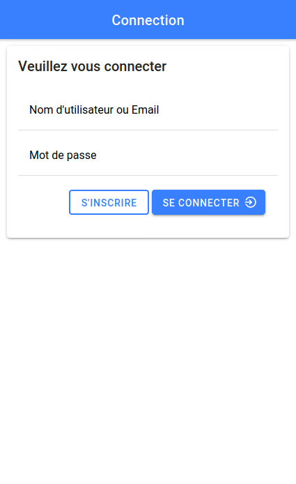
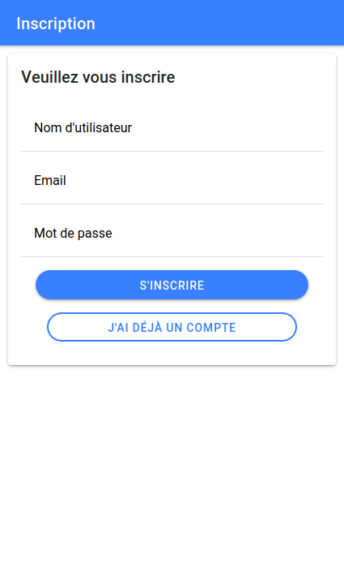
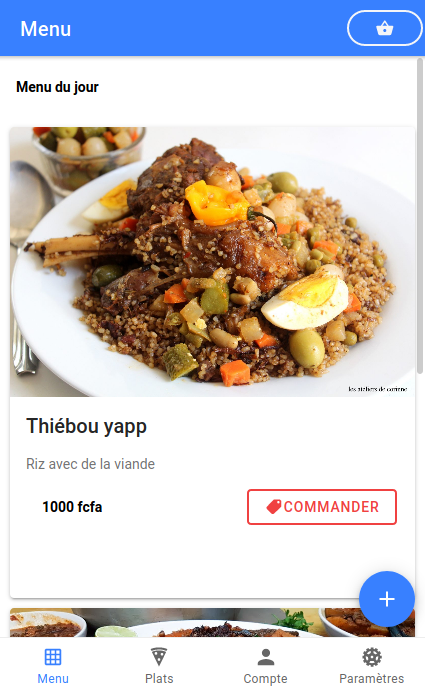
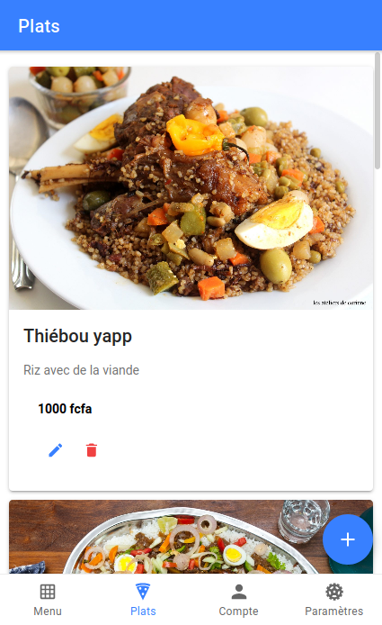
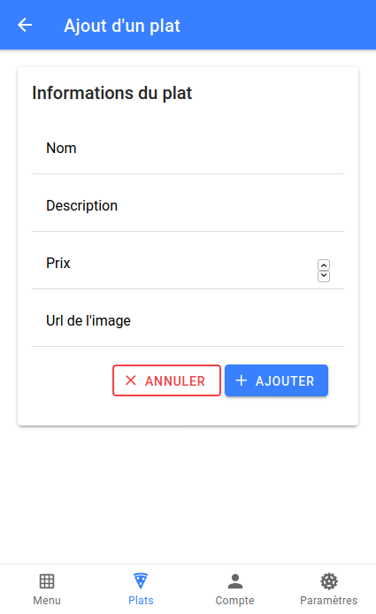
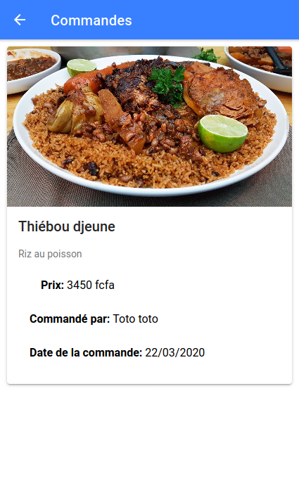
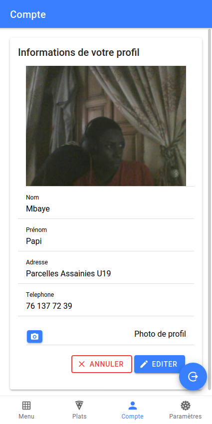
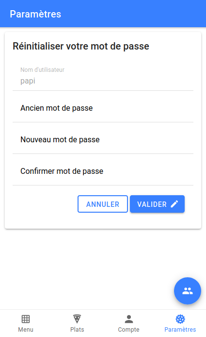
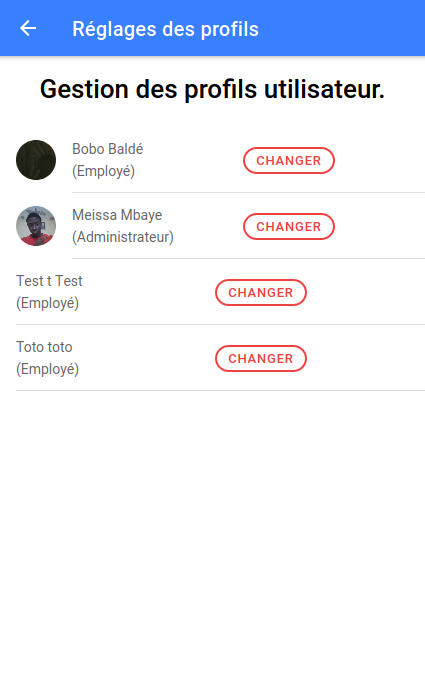

# Simple Ionic Restaurant App  

Petite application mobile avec `Ionic` et `Angular` permettant la gestion des commandes de
déjeuner dans une entreprise.  
Un administrateur sera chargé de définir le menu du jour en spécifiant les plats de ce dernier et les employés pourront, après s'être connecté, visualiser le menu en question et ainsi commander leur plat.
L'administrateur peut ainsi voir les commandes effectuées par les employés.  
Les utilisateurs (admin comme employé), ont la possibilité de modifier certains paramètres de leur profil (nom, prénom, adresse, telephone, photo de profil) mais également réinitialiser leur mot de passe.  

## Notes  

Par défaut, lorsqu'un utilisateur s'inscrit, il est enregistré comme étant `employé`. Il faudra donc se connecter au niveau du `dashboard` de `Strapi` afin de changer la propriété `statut` d'un utilisateur au besoin (afin d'accéder aux fonctionnalités de l'admin).  
Cependant l'admin, peut gérer les profils utilisateurs en changeant le statut d'un employé en `admin` ou vice versa.  

## Installation  

Après avoir cloné ce repo, placez vous au niveau de ce dernier et saisissez les commandes suivantes:  

- Installation des dépendaces (mettre un sudo avant les commandes si nécessaire)  
`npm install` ou `npm i`  

- Démarrer l'application  
`ionic serve` ou `ionic lab` (cette dernière permet de visualiser l'app sur plusieurs devices)  

### N'oubliez pas de démarrer l'api (<https://github.com/PapiHack/-ionic-restau-app-backend>), sinon pas de données :c  

### Auteur ==> Meïssa B.C MBAYE (ESP/M2GLSI/2020) <http://itdev.herokuapp.com>

### En attendant voici quelques ScreenShots de l'app :)  

    
    
    
    
    
    
    
    
    

